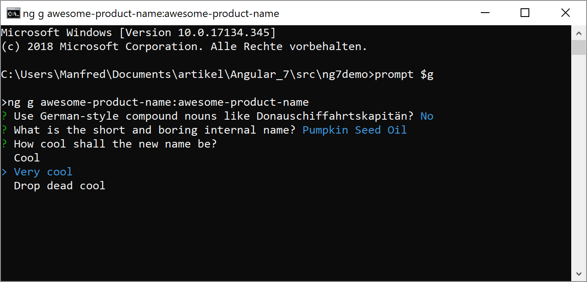

# Example: Using Prompts in Custom Schematics



This example shows how to write a custom Schematic which uses command line prompts introduced with CLI 7. The prompts are defined in ``schema.json``.

## Try it out

To try this example out, follow these steps:

1. Build the example: npm run Build
2. Install it as a node package in an Angular 7 project
    1. For testing, copy the contents of the source folder over to your project into the folder ``node_modules/awesome-product-name``.
3. Execute the following command in your project: 
    ```
    ng generate awesome-product-name:awesome-product-name
    ```